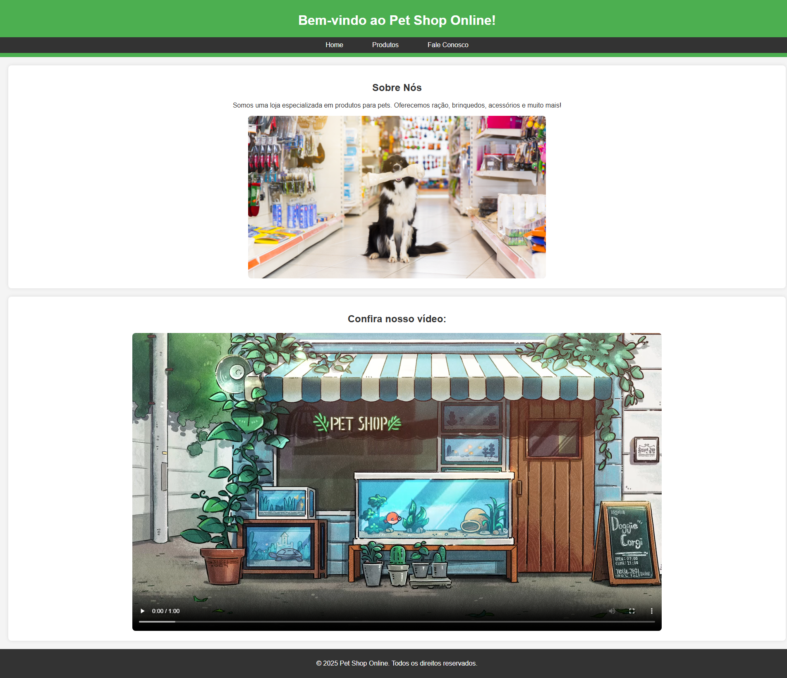
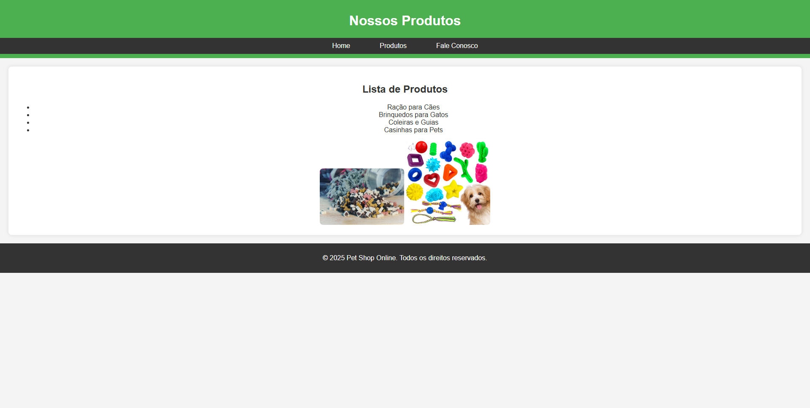
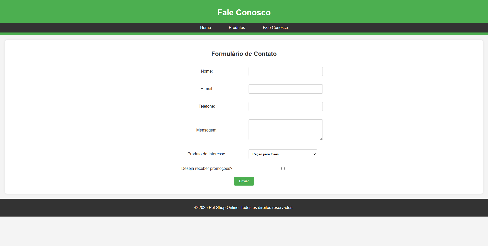

# Pet Shop Online

Este é um projeto de um site estático para um Pet Shop Online, desenvolvido como parte de uma atividade acadêmica. O site consiste em três páginas principais: **Home**, **Produtos** e **Fale Conosco**. O objetivo é demonstrar o uso de HTML5 e CSS para criar um layout responsivo e moderno.

---

## 🚀 Funcionalidades

- **Homepage**: Apresenta informações sobre o Pet Shop, um vídeo promocional e links para outras páginas.
- **Página de Produtos**: Exibe uma lista de produtos disponíveis, com imagens ilustrativas.
- **Página de Contato**: Oferece um formulário para os usuários entrarem em contato com a loja.

---

## 🛠️ Tecnologias Utilizadas

- **HTML5**: Estruturação semântica das páginas.
- **CSS3**: Estilização e design responsivo.
- **Imagens e Vídeos**: Conteúdo multimídia para enriquecer a experiência do usuário.

---

## 🖼️ Screenshots

### Homepage


### Página de Produtos


### Página de Contato


---

👨‍💻 Autor
```
Lucas da Costa
Análise e Desenvolvimento de Sistemas
Universidade Presbiteriana Mackenzie
2025
```